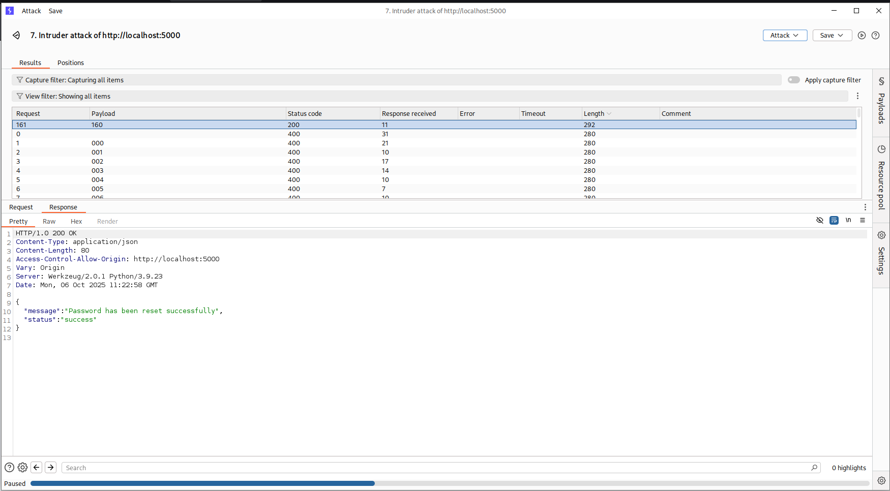
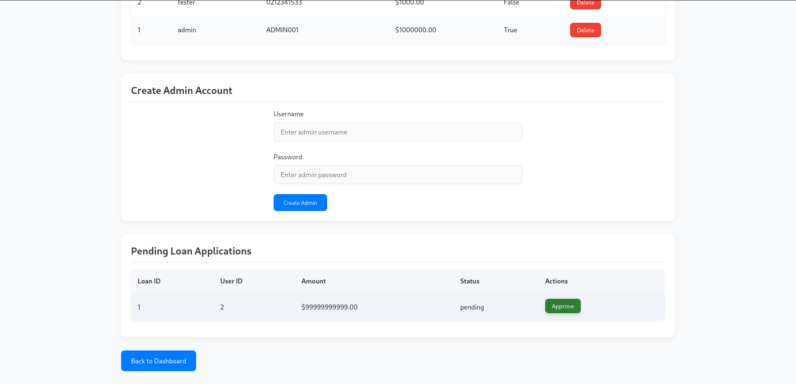

# Vulnerability Assessment & Exploitation Report — **vuln-bank**

**Author:** DILSHAD AHAMMED  
**Date:** 10/08/2025  
**Target (local):** `http://localhost:5000/`
**Deliverable:** Concise technical report (Markdown)

---

## Summary

A low-complexity but high-impact **password reset PIN brute-force** flaw in the password reset flow allowed an attacker to reset the admin password (account takeover). I exploited the weakness using Burp Intruder (000–999) and then logged into the admin panel.

**Severity:** High — allows complete takeover of high-privilege account.  
**Exploitability:** Easy — requires only local access to the web interface and automation for 3-digit PIN brute force.

---

## Scope & Setup

* App repository: `https://github.com/Commando-X/vuln-bank.git` (Docker used as recommended).
* App start command used:

  ```bash
  git clone https://github.com/Commando-X/vuln-bank.git && cd vuln-bank && docker-compose up --build -d
  ```
* Target URL: `http://localhost:5000/`

---

## Tools used

* Browser + Burp Suite (Proxy & Intruder).
* Docker / docker-compose to run the target.

---

## Finding #1 — Weak password reset PIN (3-digit brute-force)

### Description

The application exposes a password reset flow protected by a **3-digit PIN**. The PIN space is very small (000–999), and there is **no effective brute-force mitigation** (no rate limiting, no progressive delays, no account lockout or CAPTCHA). This enables an attacker to enumerate the PIN by automated requests and reset the target account password — in this case the `admin` account.

### Evidence (screenshots)


### Reproduction steps

1. Open `http://localhost:5000/`.
2. Confirm login behavior:

   * When attempting SQL injection payloads (e.g., `'|| 1=1;-- -`) the application returns **"login failed"**.
   
   * For ordinary incorrect credentials, the application returns **"Invalid credentials"**.
3. Navigate to the password reset / PIN entry endpoint .
4. Intercept the PIN submission request in Burp Suite (Proxy).
5. Send the request to **Intruder**. Place the attack position over the PIN parameter.
6. Configure Intruder payloads:

   * **Payload type:** Numbers
   * **Start:** `0`, **End:** `999`, **Step:** `1`, **Padding width:** `3` → produces `000`..`999`
   * **Attack type:** `Sniper` (single parameter)
7. Run the attack and observe responses. Identify the request that returns a different response or a redirect indicating a valid PIN.



8. Use the successful PIN to reset the `admin` password (I set it to `newAdmin`).
9. Log in as `admin` at `http://localhost:5000/login` using the new password — access the admin panel.



**Exact fields used:**

* Username: `admin`
* Reset flow PIN tested: `000` … `999` via Burp Intruder
* New password used: `newAdmin` (set during reset)

---

## Impact

* **Account takeover:** Full administrative access to the application via password reset.
* **Post-compromise:** Once admin panel access is obtained, an attacker can modify application data, view sensitive data, change configurations, create accounts, and pivot to other systems if accessible.
* **Business risk:** Unauthorized access to financial/banking application test data (sensitive), potential integrity and availability impact.

---

## Root causes

* Insecure password reset mechanism using a tiny (3-digit) numeric PIN.
* Lack of brute-force protections: no rate limiting, no lockout, no anomaly detection.
* Possibly predictable or discoverable `/console` endpoint.

---

## Remediation & Recommendations

1. **Replace short PINs with strong tokens:** Use cryptographically secure, single-use reset tokens (e.g., 20+ random characters) delivered to the account owner (via email) with short expiry.
2. **Secure reset workflow:** Require possession of a verified communication channel (email/SMS) to deliver reset tokens; do not rely on short numeric PINs.
3. **Rate limiting & account lockout:** Implement per-account and per-IP rate limits on PIN attempts; introduce temporary lockout or progressive delays after N failed attempts.
4. **CAPTCHA / bot mitigation:** Add CAPTCHA for sensitive flows (reset) or require additional authentication steps for high-privilege accounts.
5. **Audit & alerting:** Log failed/successful reset attempts and alert on anomalous patterns (e.g., rapid successive PIN attempts).
6. **Harden administrative endpoints:** Restrict access to `/console` `/admin` paths to trusted IP ranges or require prior authentication where possible.
7. **Enforce strong passwords and MFA:** After reset, force a strong password policy and enable multi-factor authentication for admin accounts.
8. **Use HTTPS:** Ensure the app uses TLS to protect credentials and reset tokens in transit.
9. **Security testing / CI gating:** Add automated security checks for weak reset mechanisms in CI or pre-deployment tests.

---

## Risk rating & justification

* **Overall rating:** High
* **Justification:** Exploitation requires minimal skill and no special privileges; compromise yields admin access and full control of the application. The consequence of compromise is severe.

---

## Short mitigation roadmap

1. Disable the current PIN reset flow immediately or restrict access to it until fixes are in place.
2. Implement per-account attempt limits (e.g., 5 attempts within 15 minutes → lockout).
3. Deliver reset tokens to verified email addresses, and expire tokens within 15 minutes.
4. Require admins to enable/require MFA.

---

## Appendix — Burp Intruder configuration (concise)

* **Target request:** PIN submission POST (captured via Proxy).
* **Positions:** the single PIN parameter value.
* **Payloads:** Numbers; Start = `0`, End = `999`, Step = `1`, Padding = `3` → produces `000`...`999`.
* **Attack type:** `Sniper` (single parameter).
* **Observation:** Look for different response length / status / redirect that indicates a successful PIN. Use response comparisons (match on location header or response body content).

---

## Closing notes

This vulnerability demonstrates how seemingly small design choices (short PIN length) create trivial attack vectors that result in total compromise. Fixing the reset flow and implementing basic anti-automation/monitoring controls will substantially reduce the risk.

---
