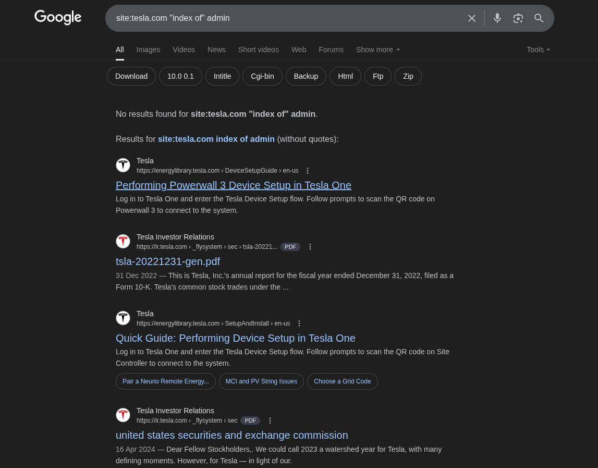
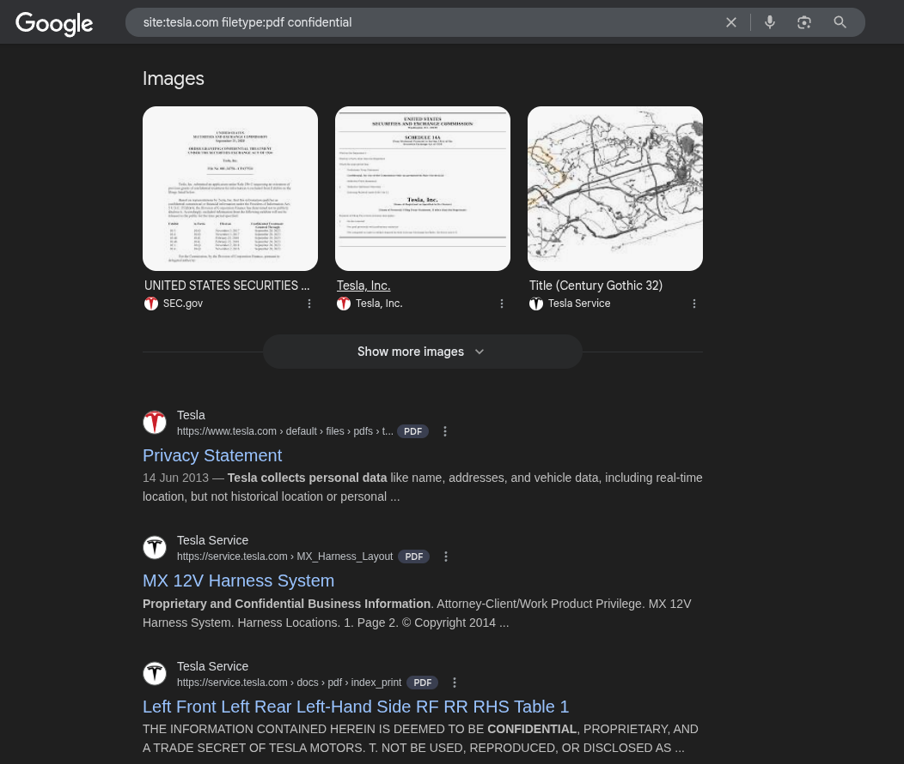
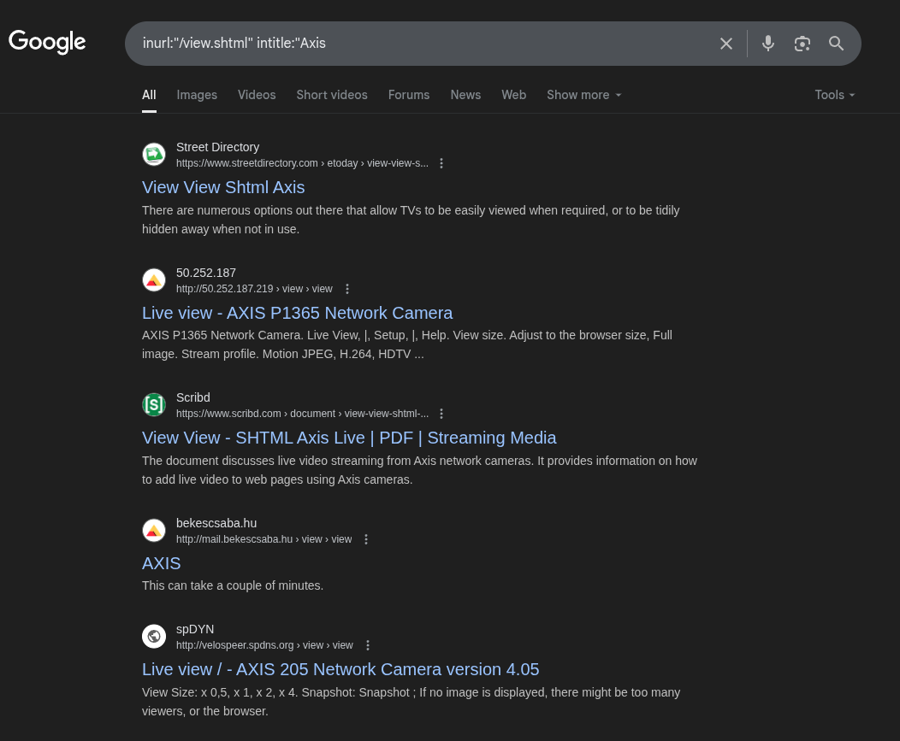

# Googe Dorking Writeup

#### **Part 1: Google Dorking on Tesla.com**

1. **Finding Exposed Files and Directories**

   Sometimes sensitive files like backup databases or configuration files might be exposed due to improper directory settings.

   * **Search Query**: `site:tesla.com "index of" admin`
   * **What it does**: Searches for directories indexed by Google that contain the word "admin". This can uncover hidden or misconfigured directories.

    
    
    **Findings from the Investigation**
    * [File 1](https://ir.tesla.com/_flysystem/s3/sec/000095017023001409/tsla-20221231-gen.pdf)
    * [File 2](https://ir.tesla.com/_flysystem/s3/sec/000110465924048040/tm2326076d13_pre14a-gen.pdf?utm_source=hs_email&utm_medium=email&_hsenc=p2ANqtz--54tBHwi0-OwQeJ0PdLfc_hxV9iyh9S36KmOrNi_xaPeSmgrM7mM7cnllYQVHmhhBYHI43)
    * [File 3](https://ir.tesla.com/_flysystem/s3/sec/000156459021004599/tsla-10k_20201231-gen.pdf)

2. **Finding Exposed PDF Files with Sensitive Information**

   Often, organizations might store sensitive information in PDF files, such as public reports, presentations, or even internal documentation.

   * **Search Query**: `site:tesla.com filetype:pdf confidential`
   * **What it does**: Searches for publicly available PDF files on Tesla’s domain that mention the word “confidential”.
   
   

   **Findings from the Investigation**
   * [File 1](https://service.tesla.com/docs/ModelY/ElectricalReference/prog-201/diagram/2023.4_ModelY-SOP5.pdf)

---

#### **Part 2: Finding Open Camera Access Using Google Dorking**

One of the more dangerous types of Google Dorking involves searching for exposed camera feeds. Misconfigured cameras can often be accessed without authentication, exposing private or sensitive video streams.

1. **Search for Exposed CCTV Cameras**

   CCTV cameras, webcams, and other live feeds are sometimes exposed due to improper security configurations. Using dorks, attackers can find these cameras online.

   * **Search Query**: `inurl:"/view.shtml" intitle:"Axis"`
   * **What it does**: Searches for Axis cameras, which are often used in security systems.
    
    

    **Findings from the Investigation**
    * [Live Camera Feed 1](http://velospeer.spdns.org/view/index.shtml?videos=one)
    * [Live Camera Feed 2](http://162.249.148.59:8000/camera/index.html#/video)

