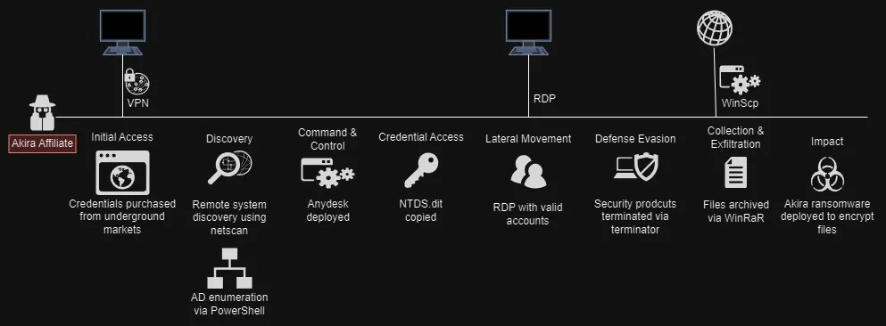
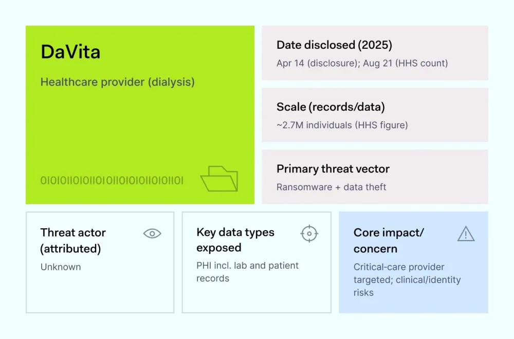
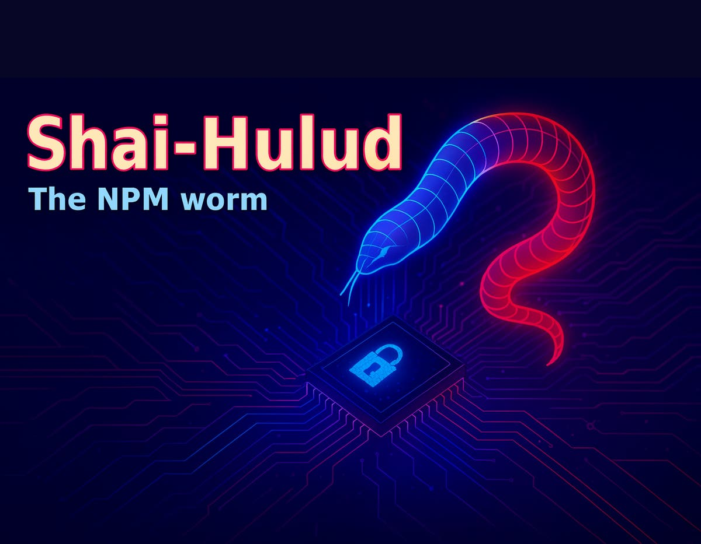

# Recent Malware Incidents Report (October 2025)

## 1. Akira Ransomware Campaign (August 2025)

**Attack Method:**
The Akira ransomware campaign exploited the SonicWall Gen 7 firewall vulnerability (CVE‑2024‑40766), targeting firms with SSL VPN enabled. Attackers leveraged improper password migration from Gen 6 to Gen 7 devices to bypass multi‑factor authentication and gain administrative access to networks. Once inside, Akira encrypted files and exfiltrated data for double extortion.

**Mitigation/Resolution:**
- SonicWall issued urgent advisories
- Recommended disabling SSL VPN access
- Credential rotation and patching of affected devices
- Restoration from clean backups
- Implementation of additional endpoint detection and network segmentation

*Source: CM‑Alliance, August 2025*

## 2. DaVita Ransomware Breach (August 2025)

**Attack Method:**
Healthcare giant DaVita was hit by the InterLock ransomware group, which infiltrated its systems between March and April 2025. The attackers deployed ransomware after gaining long‑term persistence, encrypting servers and stealing over 2.6 million patient records containing SSNs, health insurance, and medical results. The group demanded ransom under threat of data publication.

**Mitigation/Resolution:**
- Involvement of law enforcement and cybersecurity responders
- Systems restored from backups
- Affected individuals notified
- Enhanced network segmentation and identity controls
- Improved email phishing defenses

*Source: CM‑Alliance, August 2025*

## 3. Shai‑Hulud Worm Supply‑Chain Attack (September 2025)

**Attack Method:**
The Shai‑Hulud worm compromised hundreds of npm packages in a widespread open‑source supply‑chain attack. It stole cloud and GitHub credentials by embedding malicious code in npm modules. These modules automatically replicated the worm through compromised developer accounts and repositories, spreading rapidly across the ecosystem.

**Mitigation/Resolution:**
- npm maintainers and GitHub security teams removed malicious packages
- Compromised tokens revoked
- Developers instructed to rotate all credentials and audit dependencies
- Two-factor authentication enforcement
- Improved CI pipeline validation and npm security audits

*Source: CM‑Alliance, September 2025*

---

*Prepared on October 19, 2025*